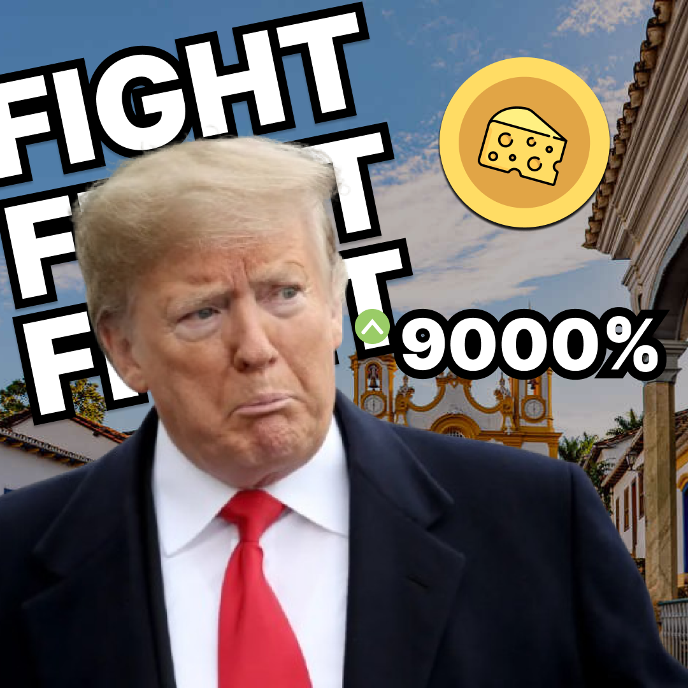

🚀 UaiCoin beats TrumpCoin and makes me a millionaire! 💸💎

Just kidding! But for a moment, I imagined what it would be like to be the next memecoin tycoon. 😂

Inspired by the hype around coins like TrumpCoin, I decided to create UaiCoin, a Brazilian memecoin that celebrates the culture of Minas Gerais. The goal? Not to get rich, but to learn and have some fun along the way!

For this project, I developed an ERC-20 smart contract for the UAI token, explored blockchain fundamentals, designed a landing page with HTML and Tailwind CSS, and worked with local testing tools like Hardhat and Ganache.

🎯 What I learned:
• How to create a token following the ERC-20 standard;
• The fundamentals of smart contracts and Solidity;
• Simulating a blockchain environment for secure development;
• Working with modern tools like Hardhat and Remix IDE;
• Building responsive and creative interfaces to showcase the project.

UaiCoin may be fictional, but the knowledge I gained is very real! 🚀

👉 Curious about the project? Check out the repository here: https://link.com

If Trump can have his own memecoin, why can’t Brazil? UAI sô! 😄

#blockchain #solidity #developer #UAIcoin #TrumpCoin #memecoin #cryptocurrency #ERC20 #smartcontracts #web3 #Hardhat #Ganache #RemixIDE #tailwindcss #soliditydeveloper #blockchaindevelopment #BrazilianCrypto #trending
